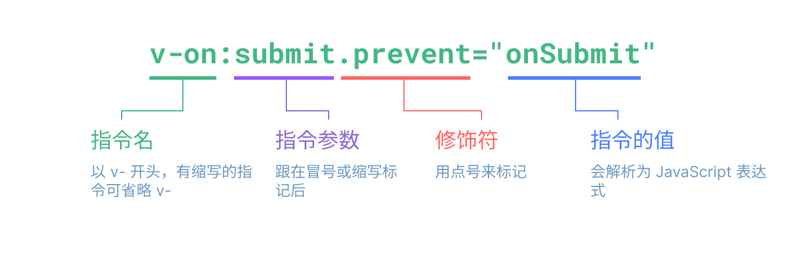

# 模板语法 {#template-syntax}

Vue 使用一种基于 HTML 的模板语法，开发者可以声明式地将已渲染的 DOM 绑定到底层组件实例的数据。所有 Vue 的模板都是合法的 HTML，能被与标准兼容的浏览器或 HTML 解析器解析。

Vue 会在底层将模板编译成高度优化后的 JavaScript 代码，结合响应式系统，当应用的状态改变时，Vue 能智能地计算出需要重新渲染的组件的最小数量，并在执行最少次数的 DOM 操作。

如果你熟悉虚拟 DOM 概念并偏好原生 JavaScript 的能力，你可以不用模板，[直接写渲染函数](/guide/extras/render-function.html)，选用 JSX 语法。但请注意它们并不与模板共享相同级别的编译时优化。

## 文本插值 {#text-interpolation}

最基础的数据绑定形式是用 "Mustache" 语法(即双大括号)<sup>[[1]](#footnote-1)</sup>进行文本插值操作：

```vue-html
<span>Message: {{ msg }}</span>
```

mustache 标签中的内容会被替换成对应组件实例上的 `msg` 属性的值，无论何时`msg` 属性发生变化，插值处的内容会同步更新。

<small>
<div id="footnote-1">[1] Mustache 是一种轻逻辑的模板语法，用于创建动态内容，如 HTML、配置文件等。它有不同语言的实现，参考 js 的实现 [mustache.js](https://github.com/janl/mustache.js/)。后面提到的 mustache 都用“双大括号”替代</div>
</small>

## 原生 HTML {#raw-html}

双大括号里面的数据会作为纯文本而非 HTML 处理，如果要输出真正的 HTML，需要使用[`v-html` 指令](/api/built-in-directives.html#v-html):

```vue-html
<p>使用文本插值: {{ rawHtml }}</p>
<p>使用 v-html 指令: <span v-html="rawHtml"></span></p>
```

<script setup>
  const rawHtml = '<span style="color: red">This should be red.</span>'
</script>

<div class="demo">
  <p>使用文本插值: {{ rawHtml }}</p>
  <p>使用 v-html 指令: <span v-html="rawHtml"></span></p>
</div>

我们遇到一个新概念，这个 `v-html` 属性叫做 **指令**。 指令是 Vue 提供的以 `v-` 开头的特殊属性，你可能可以猜到，它们会对渲染出来的 DOM 施加特殊的响应式行为。这里我们做的事情是：将 span 元素的 `innerHTML` 属性的值与当前活跃实例（active instance）的 `rawHtml` 属性保持一致。

`span` 元素的内容会替换为 `rawHtml` 属性的值，插值为纯 HTML，其中的数据绑定会被忽略。注意你不能通过拼接 `v-html` 来组合出一个模板来，因为 Vue 不是基于字符串的模板引擎，应该将组件作为 UI 重用和组合的基本单位。

:::warning 安全警告
将任意 HTML 动态渲染到你的网站上是非常危险的，这非常容易造成 [XSS 漏洞](https://en.wikipedia.org/wiki/Cross-site_scripting)。只对受信的内容使用 `v-html`，**绝对不要**拿它渲染用户输入的内容。
:::

## 绑定属性 {#attribute-bindings}

双大括号语法无法作用于 HTML 属性，遇到这种情况使用 [`v-bind` 指令](/api/built-in-directives.html#v-bind):

```vue-html
<div v-bind:id="dynamicId"></div>
```

`v-bind` 指令告诉 Vue 将 div 元素的 `id` 属性和组件的 `dynamicId` 属性的值保持一致。如果绑定的值是 `null` 或 `undefined`, 则最终渲染出来的元素会移除 `id` 属性。

### 缩写 {#shorthand}

由于 `v-bind` 特别常用，它有特定的缩写语法：

```vue-html
<div :id="dynamicId"></div>
```

以 `:` 开头的属性看起来和一般的 HTML 属性不同，但它也是合法的 HTML 属性名，能被所有支持 Vue 的浏览器正确解析。此外，它们不会出现在最终渲染出来的标签中。缩写语法是可选的，随着你深入了解它的作用，你会庆幸拥有它。

> 在接下来的指南中，我们将在示例代码中使用缩写语法，这也是大多数 Vue 开发者的用法。

### 布尔值属性 {#boolean-attributes}

[布尔值属性](https://html.spec.whatwg.org/multipage/common-microsyntaxes.html#boolean-attributes) 是通过其在元素上的出现与否来表示值为 true / false 的属性<sup>[[2]](#footnote-2)</sup>。例如, [`disabled`](https://developer.mozilla.org/en-US/docs/Web/HTML/Attributes/disabled) 是最常用的布尔值属性之一。

`v-bind` 的使用有一点不同：

```vue-html
<button :disabled="isButtonDisabled">Button</button>
```

如果 `isButtonDisabled` 的值为 [真值](https://developer.mozilla.org/en-US/docs/Glossary/Truthy) 或空字符串（即 `<button disabled="">`）时，`disabled` 属性会出现在元素上<sup>[[3]](#footnote-3)</sup>，如果它的值为假值，则 `disabled` 会被忽略。

<small>
译者注：
<div id="footnote-2">[2] 出现该属性表示该属性的值为 true</div>
<div id="footnote-3">[3] 同时 &lt;button&gt; 上出现 disabled 表示该标签的 disabled 属性为 true</div>
</small>

### 动态绑定多个属性 {#dynamically-binding-multiple-attributes}

如果你想用一个 JavaScript 对象表示多个属性，如：

<div class="composition-api">

```js
const objectOfAttrs = {
  id: 'container',
  class: 'wrapper'
}
```

</div>
<div class="options-api">

```js
data() {
  return {
    objectOfAttrs: {
      id: 'container',
      class: 'wrapper'
    }
  }
}
```

</div>

你可以用不带参数的 `v-bind` 把它们绑定到一个元素上：

```vue-html
<div v-bind="objectOfAttrs"></div>
```

## 使用 JavaScript 表达式 {#using-javascript-expressions}

目前为止我们仅在模板中绑定了一些简单的属性，但 Vue 支持在任何数据绑定的地方使用 JavaScript 表达式。

```vue-html
{{ number + 1 }}

{{ ok ? 'YES' : 'NO' }}

{{ message.split('').reverse().join('') }}

<div :id="`list-${id}`"></div>
```

这些表达式会被当作 JavaScript 代码，在当前组件实例的作用域中计算。

在 Vue 模板中，JavaScript 表达式可用在以下地方：

- 在文本插值的中（双大括号标签内）
- 在任何以 `v-` 开头的 Vue 指令绑定的属性值上

### 要用表达式而非语句 {#expressions-only}

每个绑定只支持 **单一表达式**，下面的示例代码是 **无效** 的：

```vue-html
<!-- 这是一个语句，而非表达式 -->
{{ var a = 1 }}

<!-- 条件控制同样无效，请使用三元表达式 -->
{{ if (ok) { return message } }}
```

### 调用函数 {#calling-functions}

在写绑定表达式的地方可以调用组件暴露的方法：

```vue-html
<span :title="toTitleDate(date)">
  {{ formatDate(date) }}
</span>
```

:::tip
绑定的表达式中的函数调用，在每次组件更新后都会重新调用，因此 **不应该** 有任何副作用，如改变数据或触发异步操作。
:::

### 有限的全局访问 {#restricted-globals-access}

模板中的表达式将被沙盒化，仅能够访问到 [有限的全局对象列表](https://github.com/vuejs/core/blob/main/packages/shared/src/globalsWhitelist.ts#L3)。该列表中通常会暴露内置全局对象，比如 `Math` 和 `Date`。

没有显式包含在列表中的全局对象在模板内表达式内不可访问，例如用户附加在 `window` 上的属性。如果你确定要这样做，可以自行在 [`app.config.globalProperties`](/api/application.html#app-config-globalproperties)上显式地添加他们，供所有 Vue 表达式使用。

## 指令 {#directives}

指令是带有 `v-` 前缀的特殊 attribute。Vue 提供许多 [内置指令](/api/built-in-directives.html)，包括上面我们介绍到的 `v-bind`。

指令属性的值是纯 JavaScript 表达式 （之后要讨论到的 `v-for` 和 `v-on` 是例外）。指令的作用是，在其表达式的值改变后响应式更新 DOM。以 [`v-if`](/api/built-in-directives.html#v-if) 为例：

```vue-html
<p v-if="seen">Now you see me</p>
```

这里， `v-if` 指令将基于表达式 `seen` 值的真假来移除或插入 `<p>` 元素。

### 指令的参数 {#arguments}

有的指令需要一个“参数”，在指令名后通过一个冒号隔开做标识。例如 `v-bind` 指令被用来响应式的更新一个 HTML 属性：

```vue-html
<a v-bind:href="url"> ... </a>

<!-- 缩写 -->
<a :href="url"> ... </a>
```

这里 `href` 就是一个参数，它告诉 `v-bind` 指令绑定表达式值 `url` 到元素的 `href` attribute 上。在缩写中，参数前的一切（例如 `v-bind:`）都会被缩略为一个 `:` 字符。

另一个例子是 `v-on` 指令，它会监听 DOM 事件：

```vue-html
<a v-on:click="doSomething"> ... </a>

<!-- 缩写 -->
<a @click="doSomething"> ... </a>
```

这里的参数是要监听的事件名称：`click`。`v-on` 是少数拥有缩写的指令之一，缩写为 `@`。我们之后也会讨论更多事件处理的细节。

### 动态参数 {#dynamic-arguments}

指令参数也可以使用一个 JavaScript 表达式，用一对方括号包起来：

```vue-html
<!--
注意，参数表达式有一些约束，
参见下面 “动态参数表达式约束” 一节的解释
-->
<a v-bind:[attributeName]="url"> ... </a>

<!-- 缩写 -->
<a :[attributeName]="url"> ... </a>
```

这里的 `attributeName` 会作为 JavaScript 表达式动态执行，计算得到的值会用作最终的参数。举个例子，如果你的组件实例有一个数据属性 `attributeName`，其值为 `"href"`，那么这个绑定就等价于 `v-bind:href`。

同样的道理，你也可以将一个事件处理器绑定到一个动态的事件名上<sup>[[4]](#footnote-4)</sup>：

```vue-html
<a v-on:[eventName]="doSomething"> ... </a>

<!-- 缩写 -->
<a @[eventName]="doSomething">
```

当示例中的 `eventName` 值是 `"focus"`，`v-on:[eventName]` 相当于 `v-on:focus`。

<small>
译者注：
<div id="footnote-4">[4] 这样实现的效果是，<code>&lt;a&gt</code> 标签被监听的事件会随着 <code>eventName</code> 变量的值而改变，但事件处理器都是同一个 <code>doSomething</code>
</div>
</small>

#### 对动态参数值的限制 {#dynamic-argument-value-constraints}

动态参数的值应该是一个字符串，或是 `null`，特殊值 `null` 用于显式地移除事件绑定，除此以外的任何非字符串值都会触发警告。

#### 对动态参数语法的限制 {#dynamic-argument-syntax-constraints}

动态参数表达式还有一些语法限制，因为某些字符如空格、引号等，不能用在 HTML 属性名中，下面的示例就是不合法的：

```vue-html
<!-- 这会触发一个编译器警告 -->
<a :['foo' + bar]="value"> ... </a>
```

如果你想传入一个复杂的动态参数，我们推荐使用 [计算属性](./computed.html)，我们很快就会讲到它。

当使用 DOM 内嵌模板（直接写在 HTML 文件里的模板）时，需要避免在名称中使用大写字母，因为浏览器会强制将其转换为小写：

```vue-html
<a :[someAttr]="value"> ... </a>
```
上面的代码将在 DOM 内嵌模板中转换为 `:[someattr]`。如果你的组件只有 “someAttr” 属性没有 “someattr”，这个绑定就会失效。

### 修饰符 {#modifiers}

修饰符是以点开头的特殊后缀，表明指令需要以一些特殊的方式绑定。例如 `.prevent` 修饰符会告知 `v-on` 指令对触发的事件调用 `event.preventDefault()`：

```vue-html
<form @submit.prevent="onSubmit">...</form>
```

后面介绍 [`v-on`](./event-handling.html#event-modifiers) 和 [`v-model`](./forms.html#modifiers) 的功能时，会引入其他修饰符的例子。

最后，在这里你可以直观地看到完整的指令语法：



<!-- 原图见 https://www.figma.com/file/BGWUknIrtY9HOmbmad0vFr/Directive -->

## 小结

- 本文提到的概念

```
模板语法
├─ 文本插值
├─ 原生HTML
├─ 绑定属性
│  ├─ 缩写
│  └─ 布尔值属性
│  └─ 动态绑定多个属性
├─ 使用 JavaScript 表达式
│  ├─ 要用表达式而非语句
│  └─ 调用函数
│  └─ 有限的全局访问
├─ 指令
│  ├─ 指令的参数
│  ├─ 动态参数
│  │  ├─ 对动态参数值的限制
│  │  ├─ 对动态参数语法的限制
│  └─ 修饰符
```

本节介绍 Vue 的模板系统，字面上理解，写模板就是写那些静态的、不变的页面内容——HTML 标签。关键在于 Vue 会把模板先编译成 JavaScript 代码，这解开了动态渲染的威力：

  - 文本插值语法，在双括号中写入 JavaScript 表达式，Vue 会算出表达式的值（通常是字符串类型），插入双括号所在的位置，用于动态渲染文本。
  - Vue 指令，让你可以动态操作 HTML 标签中的属性：动态选择要操作的属性（动态参数）、动态设定属性的值。

你不必在写模板的时候就把内容确定下来，相反，你写变量作为占位符放入模板，变量的值可能来自调用接口返回的数据，可能由用户点击一个按钮产生，只要你用 Vue 响应式机制定义变量，那么每当变量的值发生改变，模板中出现这个变量的地方也会相应改变。
